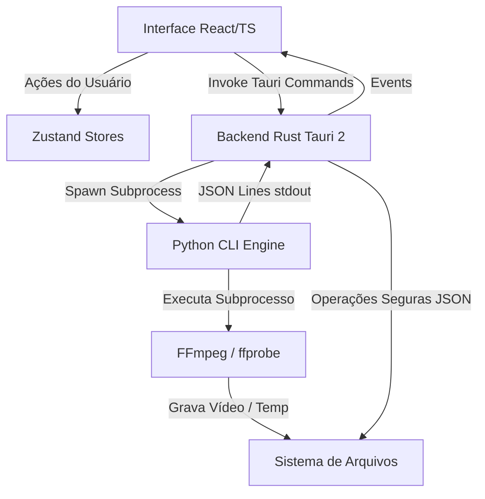

# Documento de Arquitetura — Trecho Studio

## 1. Visão Geral
O Trecho Studio foi projetado com uma separação clara de responsabilidades entre a Interface do Usuário (React/TS), a orquestração do sistema operacional (Tauri 2/Rust) e o processamento pesado de mídia (Python/FFmpeg).

## 2. Responsabilidades dos Componentes

### 2.1 Interface (React + TypeScript + Zustand)
- **Apresentação**: Renderização da UI limpa e sóbria (tons de cinza/preto, bordas retas).
- **Player de Vídeo**: Execução do player local usando a tag HTML5 `<video>`.
- **Interações**: Atalhos de teclado (`I`, `O`, `Espaço`, `Setas`) para marcar os limites do corte.
- **Gerenciamento de Estado**: O `Zustand` controla a seleção do projeto ativo e o progresso da renderização. Lógicas de formulários ou estados locais permanecem nos componentes React correspondentes.

### 2.2 Orquestrador (Tauri 2 + Rust)
O Tauri 2 serve como ponte nativa.
- **Verificação de Diagnóstico**: Executa verificações rápidas no sistema operacional para validar se `python`, `ffmpeg` e `ffprobe` estão no PATH, bem como a permissão de escrita no workspace.
- **Controle de Processos**: Invoca o comando Python via `std::process::Command`. Gerencia a identificação do processo ativo (`Pid`) no Windows para garantir que o encerramento do subprocesso seja completo, eliminando subprocessos filhos (FFmpeg) de forma limpa ao cancelar ou ao fechar a janela principal do app.
- **Leitura/Escrita de Projetos**: Realiza gravações seguras do arquivo `project.json` (usando arquivo temporário `.tmp` e gerando backups `.backup` para evitar corrupção por encerramentos abruptos).
- **Abertura de Arquivos**: Utiliza a API de abertura segura do sistema para revelar arquivos ou pastas no Explorer.

### 2.3 Processamento (Python + FFmpeg/ffprobe)
O motor Python (`engine/trecho_engine`) encapsula as operações de mídia.
- **Probe**: Executa o `ffprobe` com saída JSON estruturada para inspecionar os detalhes do vídeo de entrada (resolução, duração, codecs).
- **RenderPlan**: Um plano de renderização simples em formato de dados dataclass que valida caminhos, limites e resoluções antes de tocar no FFmpeg.
- **FFmpeg Builder**: Monta a cadeia de argumentos de filtros de vídeo para redimensionamento e reenquadramento:
  - **Cover (Preencher e cortar)**: `scale=W:H:force_original_aspect_ratio=increase,crop=W:H`
  - **Contain (Conter com barras pretas)**: `scale=W:H:force_original_aspect_ratio=decrease,pad=W:H:(ow-iw)/2:(oh-ih)/2:black`
- **Progress Parser**: Lê a saída estruturada do FFmpeg (`-progress pipe:1`) e envia eventos de progresso estruturados via `stdout` no formato JSON Lines (uma linha JSON por evento). Logs técnicos normais e erros são roteados para o `stderr`.

## 3. Tratamento de Erros
Os erros são codificados de forma consistente em todas as camadas (por exemplo, `FFMPEG_NOT_FOUND`, `MEDIA_PROBE_FAILED`, `INVALID_CLIP_RANGE`). 
Qualquer erro no backend ou no engine Python gera uma linha JSON `{"type": "render.failed", ...}` que o Rust repassa ao frontend para exibição limpa ao usuário.

## 4. Runtimes de Desenvolvimento vs. Distribuição Definitiva
Os diretórios `python-embed/` e `ffmpeg/` que residem na raiz do repositório são runtimes temporários e isolados de desenvolvimento local. Eles existem apenas para dar suporte aos testes imediatos e garantir que a suite de testes Python e o pipeline FFmpeg rodem sem conflitos com outras versões globais da máquina de desenvolvimento.
A estratégia de distribuição oficial e definitiva para produção não dependerá destas pastas locais nem exigirá que o usuário final instale Python ou FFmpeg globalmente:
- **Interpretador Python**: Será embutido e distribuído como um executável/pasta **Sidecar do Tauri**.
- **FFmpeg & ffprobe**: Serão distribuídos como binários estáticos nativos (sidecars/recursos compilados para cada plataforma alvo).

